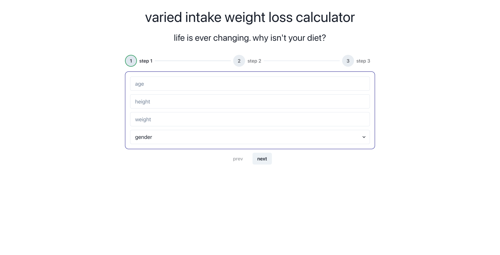

# the healthy weightloss calculator 

## [try it yourself here](https://tiganabryan.github.io/healthy-weightloss-calculator-react/)

the varied intake weight loss calculator allows you to input multiple intakes for safe weight loss.
weight loss calculator websites give you one intake option for the entirety of your weight loss journey -- this isn't healthy or realistic. your resting intake and active intakes must fluctuate so you have enough energy to function.

 

this was created with Jean Verster's Chakra UI Steps component (https://github.com/jeanverster/chakra-ui-steps).

# features
- multi step form
- dynamic number of calorie input fields
- male and female weightloss calculations from input
- responsive design
- react + chakra UI

# background info
- bmr: basic metabolic rate (calories your brain needs to function)
- tdee: total daily energy expenditure (calories your body needs, relative to activity level)
- deficit: the difference between the calories consumed and the tdee, this is what causes weight loss

# coming soon
- redux toolkit
- form validation
- option to switch to imperial
- option to email diet intakes to user

# report bugs
find a bug? please [create an issue](https://github.com/tiganabryan/healthy-weightloss-calculator-react/issues) and we'll fix it together for a better calculator:)

# contribution
contributions are always welcome! here's how:

- fork the repository ([here is the guide](https://help.github.com/articles/fork-a-repo/)).
- clone to your machine git clone https://github.com/YOUR_USERNAME/healthy-weightloss-calculator-react.git
- make your changes
- create a pull request

# changelogs

## sept 20th, 2022
  - **brand new react version**

### [previous html/css/js/scss version](https://github.com/tiganabryan/varied-intake-calculator)
### june 6th, 2022
  - **male and female input**
### may 24, 2022
  - **female-input-only**
### may 23, 2022
  - **initial release bootstrap-only**

# license
[MIT License](http://opensource.org/licenses/MIT)

---

hope you're having a beautiful day 🤍

